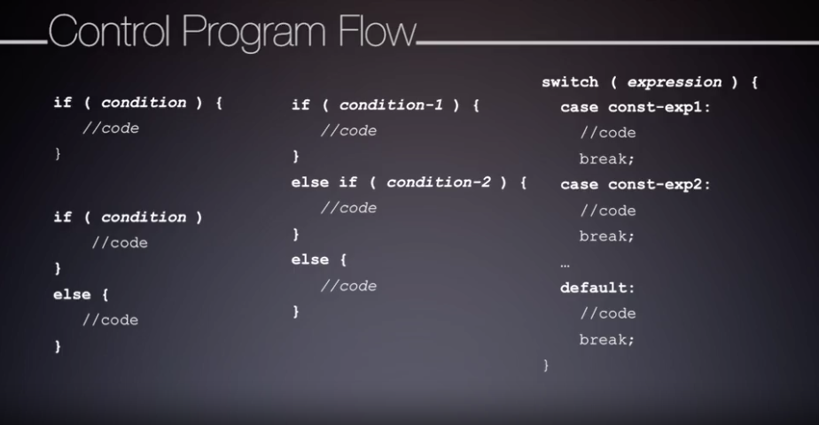
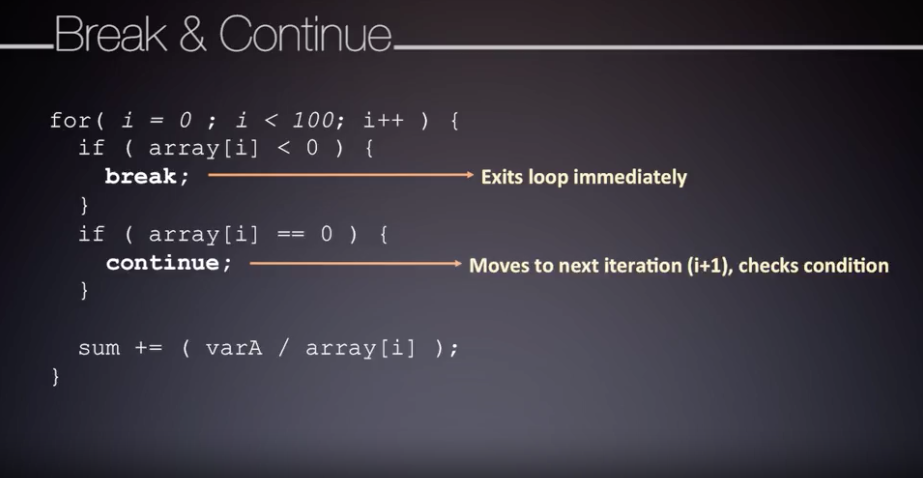

# Embedded System Development Components

  * [Introduction to Embedded Systems](#introduction-to-embedded-systems)
  * [Embedded Software Engineering](#embedded-software-engineering)
  * [C-Programming Review](#c-programming-review)

## Introduction to Embedded Systems

Specific design decisions will be made in each embedded application for levels of performance, power, and timing.
By directly quantifying these characteristics, you can begin to create a list of functional specifications.
These specs provide detailed criteria needed to evaluate the capabilities of different target platforms.
This analysis is dependent on the hardware architecture and how efficient your coding is.

---

The software development platform you will interact with has many parts.
* **Printed Circuit Board ( PCB )** is a substrate of conductive wires which interconnect
many integrated circuits and passive developments soldered onto the board.

An external programmer is connected to the embedded systems processor, in order to install a target application
into the internal memory.  Modern designs have begun to integrate extra onboard programmer debugger hardware
to simplify this process.
* **Host Machine** is responsible for developing, compiling, and coordinating the software installation 

---

The Launchpad from Texas Instruments shows an example of these systems on a PCB.
You can see the processor, the debugger emulator programmer and the PCB itself.

---

One solution for the processing core would be a microcontroller. Microprocessors and microcontrollers
are *not* the same. A microcontroller is a microprocessor with added functionality such as memory and peripheral hardware.
* **Central Processing Unit ( CPU )** is the processor part of the microcontroller that runs our software
by fetching and executing assembling instructions from memory.  These instructions perform math and logic operations
as well as coordinating data movement.
    * **Registers** store operation data and system state
    * **Arithmetic Logic Unit ( ALU )** performs the fundamental low level assembly operations
    * **Interrupt Controller** coordinates asynchronous event requests for the processor
    * **Debug Interface** troubleshoots installed programs

---

The CPU and its subsystems interact with other microcontroller resources through one or more buses.
* **Bus Controller** aids the processor in data transmission between memory and peripherals
* **Memory** holds data that we operate on as well as the program that we're executing
* **Clock** system provides synchronizations across all these components
* **Power Management** hardware is used for regulation and monitoring

---

A variety of peripheral hardware maybe included in a micro controller.

---

An example microcontroller can be seen in the Texas instrument's MSP432.
This contains one of the ARM Cortex M4 processors and a large number of peripheral hardware subsystems.

Each of the core microcontroller components is represented in this architecture
and there are numerous modules of each peripheral type.

## Embedded Software Engineering

Software designers need to understand a project's purpose and required operation specifications.
* **Flow Diagram**
  * how a particular piece of software or algorithm should behave
* **Block Diagram**
  * how different blocks of code communicate and connect to one another
  * software system layers

---

An example of a typical software organization can be seen with an OS-based design.  There are low-level Device Drivers
that interact with Hardware. There are software to help boot or start the system. There's an operating system
to schedule processes and manages resources. There are shared libraries that many software components use
and finally the higher level software reflects user applications.

---

* **Bare-Metal Firmware ( FW )** is code which directly interfaces with the hardware
  * requires deep knowledge of the hardware
    * configuration of bare-metal
    * hardware timing and limitations
    
* **Hardware Abstraction Layer ( HAL )** allows the application layer developer to write platform independent code
  * modular component with well-defined interface
  * software above HAL is agnostic to the specific hardware implementation

---

* **Component Design**
  * define small functional software blocks for certain tasks
  * reusable across different systems, architectures, and platforms
  * require good interface definitions for successful implementation

---

* **Simulators**
  * software that imitates the intended hardware's behavior without the actual hardware
* **Emulators**
  * hardware platform that imitates the operation of your intended system
* **Compilers**
  * create executable code for a specific architecture

---  

* **Installers**
  * allow compiled executable programs to be installed onto a platform
* **Debuggers**
  * allow programmers to test and validate executable programs

---

---

C-Programming is the most widely used language for embedded software design.
* C-Programming benefits
  * low level hardware interactions
  * high level software language features
* C-Programming VS assembly language
  * C is high level enough that you do *not* need to know every detail
  about the very specific assembly level architectures
  
---

Typical embedded engineers actually write a form of C called Embedded C. Embedded C differs
from C because it puts a focus these key features.

## C-Programming Review

---

* data types are architecture-dependent
* C standard specifies the minimum sizes for data types

---

---

---

---

---

---

---

