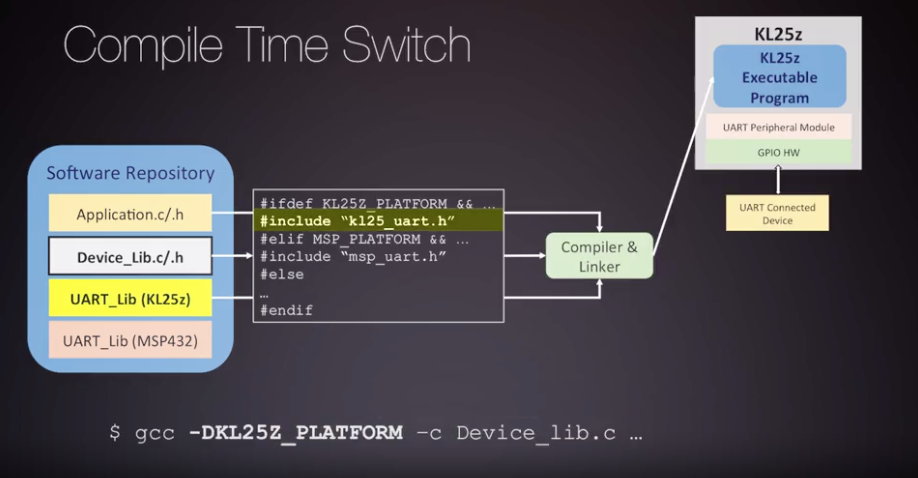

# Compilation with GCC and GNU Make

## Introduction to Build Systems using GNU Toolsets

GNU bundles many useful compilation tools together, and we'll often refer to this as our toolchain.

---

The main job of the compiler toolchain is to translate a high-level language
into architecture specific languages.

---

The architecture specific language we need to translate our C-Program into is called assembly.
Assembly language does not directly get installed onto the processor. The assembly is translated into machine code,
which is a binary encoding of assembly instructions. This machine code is what the processor understands
and uses to perform work.  The machine code binary representation, these encoded instructions, 
an be looked up in the processor's Instruction Set Architecture, or the ISA.

---

Our toolchain for building a software project and installing it will include many applications of the GCC toolchain.
In general, you can think of compilation as converting source files into object code. These source files can be
assembly or C programs. You can perform this translation as many steps as you like, but eventually,
these files have to head into the linker.

---

* **Preprocessor** transforms C code into preprocessed C code
  * evaluates preprocessor directives
  * performs macro substitution
* **Compiler** transforms preprocessed C code into assembly code
* **Assembler** converts assembly code into object code ( non-human-readable binary data )
* **Linker** combines object files into a single executable
  * reference symbols between object files are resolved
* **Locator** maps all addresses of code and data into the processor's memory space

The final file should be a target executable which can be installed on the target system.  You should note
that once you compile a project, the executable only works on the architecture you compiled it for.
It cannot be run on other systems.

We have to cross compile microcontroller builds because the microcontroller itself
does *not* usually have an operating system or the resources for programs like GCC
to be installed for us to perform a build. ( More advanced machines may have this capability. )

An on board debugger that can help us with installing. This does *not* change how the Cross Compiler operate.

---

The GCC tool chain will *not* be the only GNU application that will help us during our software development.
As you begin to learn the ins and outs of building, you will learn that building large software projects can be tedious.
Managing the compilation of many files, with all their respective compile options becomes very cumbersome.
To help with this, you'll be introduced to another useful tool in the GNU tool chain called Make.
* **Make** is a tool that controls the generation of executables and other non-source files of a program
from the program source files

## Compiling and Invoking GCC

Sometimes the steps of building might be combined into a single application depending on your compiler toolchain.
For instance, GCC toolchain combines pre-processing and compiling into the application called GCC.
The assembler is the application, AS. And the linker and locator are combined into an application
called LD. However, you can perform the full build just using GCC directly.

Machines can install many compiler toolchains. Some of these GCC compilers have very specific information
about an architecture. Vendor, OS, or even the ABI in the name. The two arm compilers listed in this picture
are cross-compilers for two different architecture targets. You can see one is for an embedded system
with a Linux OS installed, and the other is for a Bare-Metal embedded target. You should remember
that Bare-Metal firmware means to write code directly to interface with hardware. The GCC compiler
is a standard compiler for this target.

You will be working with two versions of GCC for this course.

---

All necessary options must be passed on to gcc and down to each stage of the build process.

---

---

---

The binary coded operations are referred to as operation codes, or op-codes. Some op-codes also have
some associated information about the operands, or the data, they are operating on. We will discuss
this in more detail, and the machine code translation, in follow up modules.

---

*Example 1: create a binary executable **main.out** from **main.c***

*Example 2: compile object file **main.o** from **main.c*** but stop before linking

---

Let's translate just the main.c to assembly. We can run the following commands to stop GCC
at compilation proper stage with the **-s** option:

Now we run this flag with a **-g** flag, which adds debug symbols. This will help us debug executables later.
You will see if you open up your assembly file, main.s, there is a ton more information added.

## Preprocessor Directives

The preprocessor is bundled with the gcc application. You may remember that we said the preprocessor
takes your original files and transforms them based on the directives you have defined within a file.
You can think of this transformation as a search and replace for many directives.
  * **-E** option tells the compiler to stop after the preprocessing stage

----

---

---

---

---

## Creating Header and Implementation Files

## Linkers

## Make

## Makefiles

## Other Useful GNU Bin Tools

