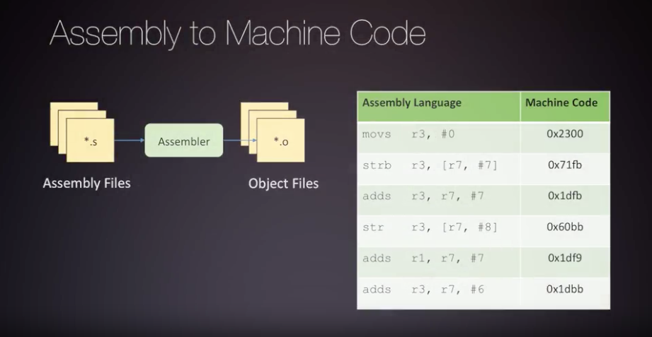
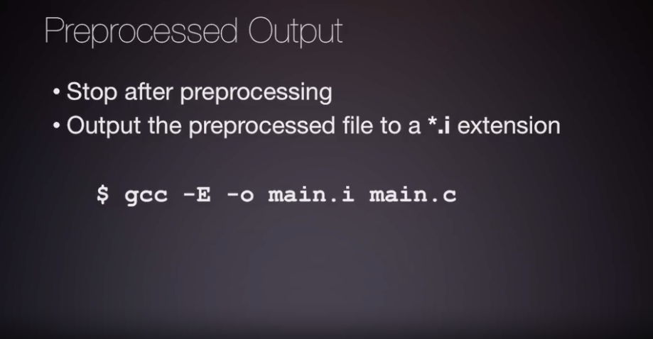
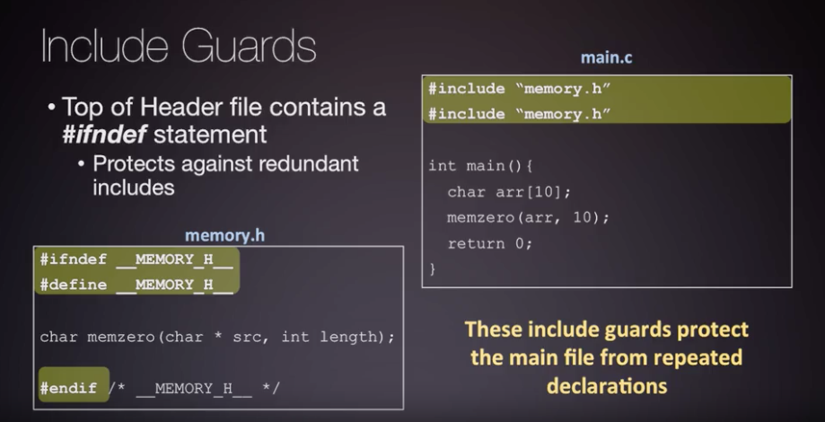
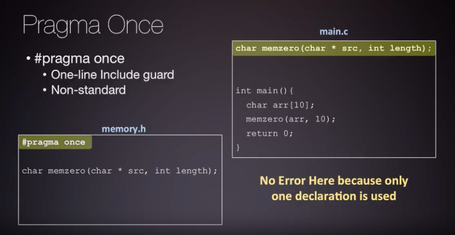
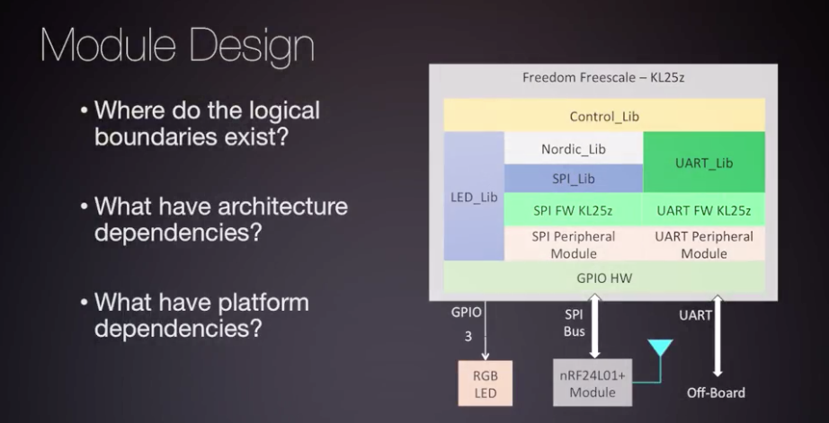
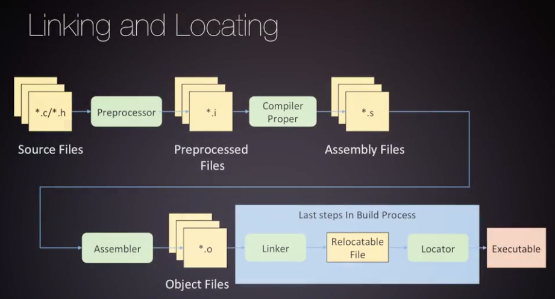
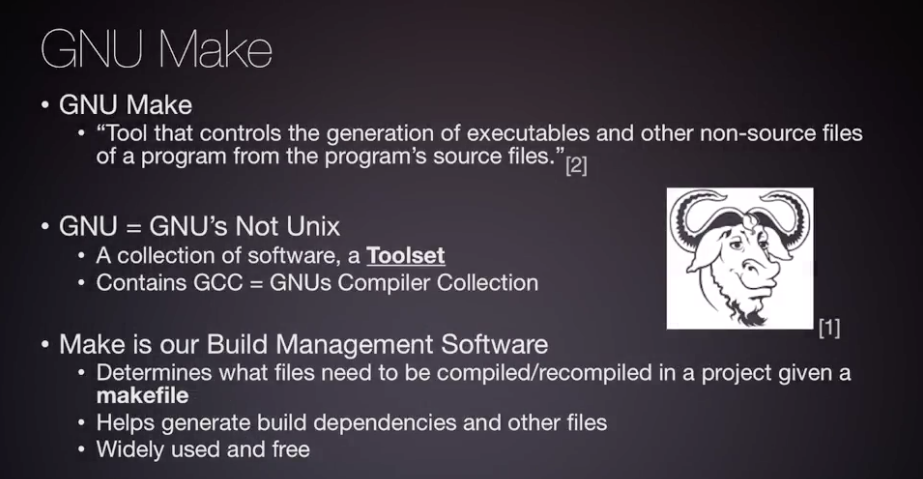

# Compilation with GCC and GNU Make

  * [Introduction to Build Systems using GNU Toolsets](#introduction-to-build-systems-using-gnu-toolsets)
  * [Compiling and Invoking GCC](#compiling-and-invoking-gcc)
  * [Preprocessor Directives](#preprocessor-directives)
  * [Creating Header and Implementation Files](#creating-header-and-implementation-files)
  * [Linkers](#linkers)
  * [Make](#make)
  * [Makefiles](#makefiles)
  * [Other Useful GNU Bin Tools](#other-useful-gnu-bin-tools)

# Introduction to Build Systems using GNU Toolsets

GNU bundles many useful compilation tools together, and we'll often refer to this as our toolchain.

---

The main job of the compiler toolchain is to translate a high-level language
into architecture specific languages.

---

The architecture specific language we need to translate our C-Program into is called assembly.
Assembly language does not directly get installed onto the processor. The assembly is translated into machine code,
which is a binary encoding of assembly instructions. This machine code is what the processor understands
and uses to perform work.  The machine code binary representation, these encoded instructions, 
an be looked up in the processor's Instruction Set Architecture, or the ISA.

---

Our toolchain for building a software project and installing it will include many applications of the GCC toolchain.
In general, you can think of compilation as converting source files into object code. These source files can be
assembly or C programs. You can perform this translation as many steps as you like, but eventually,
these files have to head into the linker.

---

* **Preprocessor** transforms C code into preprocessed C code
  * evaluates preprocessor directives
  * performs macro substitution
* **Compiler** transforms preprocessed C code into assembly code
* **Assembler** converts assembly code into object code ( non-human-readable binary data )
* **Linker** combines object files into a single executable
  * reference symbols between object files are resolved
* **Locator** maps all addresses of code and data into the processor's memory space

The final file should be a target executable which can be installed on the target system.  You should note
that once you compile a project, the executable only works on the architecture you compiled it for.
It cannot be run on other systems.

We have to cross compile microcontroller builds because the microcontroller itself
does *not* usually have an operating system or the resources for programs like GCC
to be installed for us to perform a build. ( More advanced machines may have this capability. )

An on board debugger that can help us with installing. This does *not* change how the Cross Compiler operate.

---

The GCC tool chain will *not* be the only GNU application that will help us during our software development.
As you begin to learn the ins and outs of building, you will learn that building large software projects can be tedious.
Managing the compilation of many files, with all their respective compile options becomes very cumbersome.
To help with this, you'll be introduced to another useful tool in the GNU tool chain called Make.
* **Make** is a tool that controls the generation of executables and other non-source files of a program
from the program source files

# Compiling and Invoking GCC

Sometimes the steps of building might be combined into a single application depending on your compiler toolchain.
For instance, GCC toolchain combines pre-processing and compiling into the application called GCC.
The assembler is the application, AS. And the linker and locator are combined into an application
called LD. However, you can perform the full build just using GCC directly.

Machines can install many compiler toolchains. Some of these GCC compilers have very specific information
about an architecture. Vendor, OS, or even the ABI in the name. The two arm compilers listed in this picture
are cross-compilers for two different architecture targets. You can see one is for an embedded system
with a Linux OS installed, and the other is for a Bare-Metal embedded target. You should remember
that Bare-Metal firmware means to write code directly to interface with hardware. The GCC compiler
is a standard compiler for this target.

You will be working with two versions of GCC for this course.

---

All necessary options must be passed on to gcc and down to each stage of the build process.

---

---

---

The binary coded operations are referred to as operation codes, or op-codes. Some op-codes also have
some associated information about the operands, or the data, they are operating on. We will discuss
this in more detail, and the machine code translation, in follow up modules.

---

*Example 1: create a binary executable **main.out** from **main.c***

*Example 2: compile object file **main.o** from **main.c*** but stop before linking

---

Let's translate just the main.c to assembly. We can run the following commands to stop GCC
at compilation proper stage with the **-s** option:

Now we run this flag with a **-g** flag, which adds debug symbols. This will help us debug executables later.
You will see if you open up your assembly file, main.s, there is a ton more information added.

# Preprocessor Directives

The preprocessor is bundled with the gcc application. You may remember that we said the preprocessor
takes your original files and transforms them based on the directives you have defined within a file.
You can think of this transformation as a search and replace for many directives.
  * **-E** option tells the compiler to stop after the preprocessing stage

----

---

---

---

---

# Creating Header and Implementation Files

---

---

---

---

* Static libraries can be created using the archiver GNU tool **ar**

---

# Linkers

Assembly and C files get compiled from the same project into objects. Compiled library code is pulled
in during linking.
* **Linker File** is input into our linking and locating stage
  * informs locator how to map the executable into the proper addresses
  * gcc **-T** flag

---

---

Pre-compiled static libraries will directly link at linking time into your output executable.

Dynamically linked symbols will contain paths to dynamic libraries already installed on your device.
This could cause issues if there was an incompatibility of the library that is installed on the device
and the library headers you are including

If you are writing code for an embedded or an embedded OS platform, there are likely libraries already installed
on the device. So there's no reason to statically compile and upload. Instead, you can just dynamically link
with these at runtime, saving code space.

---

You should wonder what happens before main is called. There are startup routines that run
before main that are usually defined in some C standard libraries.

* Example: https://en.wikipedia.org/wiki/Crt0

These are automatically included in your build as a static library. If you directly invoke the linker instead
of letting GCC automatically include this, you will see an error when you cannot find the entry
or extra routines around main. Invoking the linker directly will have you give it these libraries manually.
You can also tell GCC to stop this if you wish. But that would mean you have to define your own initialization
and exit software routines. You can do this by providing the -nostdlib flag.

---

Each architecture is very different, so the locator will need some special direction on how to perform
this general file to specific address mapping.  The linker file contains these special directions
that are used during the memory relocation process. This file provides the locator with information
on where the physical memory regions of the processor interface with the defined code regions.
This file is architecture-dependent and it needs to know what the physical memory map of your embedded system is.

Your program will be split into many memory regions during installation. These segments are the physical parts
of memory on your microcontroller. In contrast, your program executable is also broken up into many sections
of code and data. These sections are then mapped into these physical memory segments. An example
of different segments include the code, initialization data, stack, and heap. Since the different physical memory
segments are going to be in different locations or addresses, the linker needs to know where code memory
should be assigned. Also, for the data that code uses, exact addresses need to be given to your program
so it can find the data it's trying to operate on.

Each memory segment also provides the starting location and the length of memory that our program data
can be installed into. The total number of memory segments must be equal to or larger in size than
what the total compiled code and data sections add up to, otherwise you will have errors at installation.
To help prevent this, the linker script can also contain small checks to verify that your memory regions
are not overallocated. Here we have an example where we verify that the heap in the stack are not overflowing
into one another in data memory. And if they do, the linker should throw an error and exit.

---

After you've finished linking and locating, you may be interested in seeing how the memory allocation was done.
For this, you can tell the linker to produce a map file. This file will provide information on how all
of these regions and memory segments were used and allocated. This map file also gives you specific addresses
for the allocations.  In order to generate a map file, you need to provide the linker the map flag.

If you choose to invoke the linker indirectly through the compiler, you can still specify these flags
by providing the -Wl or -Xlinker flag with GCC. And this allows us to pass flags down through GCC to the linker.

---

# Make

Built systems are very important for software teams. Without them, the process of creating a complex target executable
would be very tedious and error prone for typical developer. There are many build generation systems out there
besides make but make is still widely used today.

Build systems allow for abstraction from the target software and architecture, so that they are portable
and can be added to version control. This provides a mechanism for teams to create consistent builds over time
without loosing any information about the build configuration.

# Makefiles

Make can be configured to use whichever Complier Toolchain and build process of your choosing.
You could use vendor provider toolchains or continue to use GCC as the toolchain with the same process
to generate files that we did with our five steps of building. Make could even be configured
to support multiple versions of a compiler or even multiple compilers with the same Makefile.

---
*Make examples:*

If I run make all, this will perform a complete build to create an executable output file.
The term all which uses an arbitrary name for a compile all type of target.

As you can see all individual compile command were run for each file. In addition
a final link command was run. We can see that the current directory now contains of these output files
from the build process.

We can also define our build targets to run individual build files like the generation
of the main.o object file. We could do this by running make main.o, as you can see only a single command
was issued for the build and all the appropriate command options were put in there. Leaving in this folder
a single main.o file.

---

---

---

---

---

---

# Other Useful GNU Bin Tools

