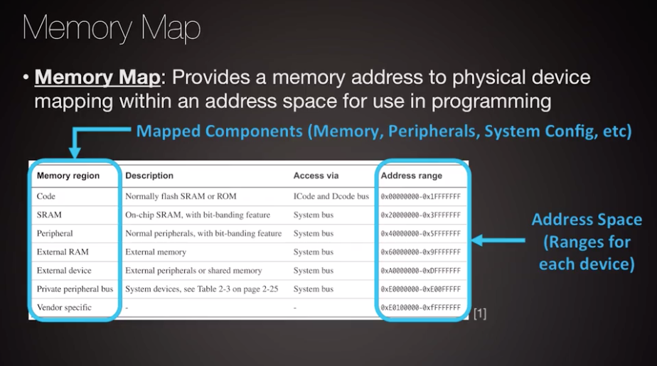

# Memory Types, Segments, and Management
* [Introduction to Memory Organization](#introduction-to-memory-organization)
* [Memory Architectures](#memory-architectures)
* [Memory Segments](#memory-segments)
* [Data Memory](#data-memory)
* [Special Keywords](#special-keywords)
* [The Stack](#the-stack)
* [The Heap](#the-heap)
* [Code Memory](#code-memory)

# Introduction to Memory Organization

* determine **memory footprint** before selecting a platform
* **FLASH**
	* program code
	* does *not* require power to retain information
	* ranges from 32 KB to 256 KB
* **RAM**
	* program data
	* requires power to retain information
	* ranges from 4 KB to 32 KB

* software to hardware translation
	* **linker file** describes memory regions to the build system
		* segment to sub-segment code to memory mapping
		* build a program with assigned memory addresses

* **dedicated controller** needed to configure, read, and write data in **FLASH** and **RAM** memory
	* built into the microcontroller
	* communicates with the **CPU** via a **BUS**

* *Example: add external memory to your system*
	* **EEPROM:** electrically erasable programmable read-only memory
	* **GPIO:** general purpose input/output
	* **SPI:** serial peripheral interface

* **register** memory
	* *not* associated with the installed program
	* exists across multiple microcontroller entities
	* stores configuration and runtime information ( the state of a program )
* **general purpose** registers store operands for CPU instructions
* **special purpose** registers store program state
	* current instruction
	* program counter

# Memory Architectures

## Capacity

## Volatility

## Access

## Latency

# Memory Segments

* Compiler
	* platform independent
	* CPU target architecture dependent
* Linker
	* platform dependent

* executable is mapped into physical memory (address space) via locating
* single address space, multiple segments / sub-segments

* ABI = application binary interface
	* compiler rules to perform translation from high-level language to architecture specific machine code
		* how to use the CPU and its registers

* **.data**
	* stack
	* heap
	* data
	* bss = block started by symbol [[wikipedia.org](https://en.wikipedia.org/wiki/.bss)]
		* in embedded software, the bss segment is mapped into memory that is initialized to zero by the C run-time system before main() is entered
		* **"Better Save Space"** since the BSS segment only holds variables that don't have any value yet, it doesn't actually need to store the image of these variables
* **.code**
	* intvecs = interupt vectors
	* text
	* read-only data
	* bootloader

# Data Memory
A data segment contains many different segments that are used for different kinds of data, allocation of data
can be at compile time or at run time.  Certain parts of the data segment can be reused and others exist
for the lifetime of a program.  Scope and access to variables can also dictate the section of the data segment
where certain pieces of data exist. 

* external non-volatile memory can be connected to the microcontroller to retain data between power cycles

# Special Keywords (Const, Extern, Static)

# The Stack

# The Heap

# Code Memory

