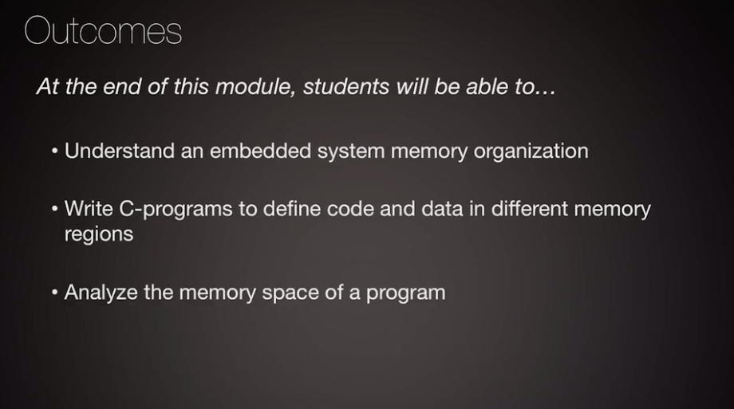
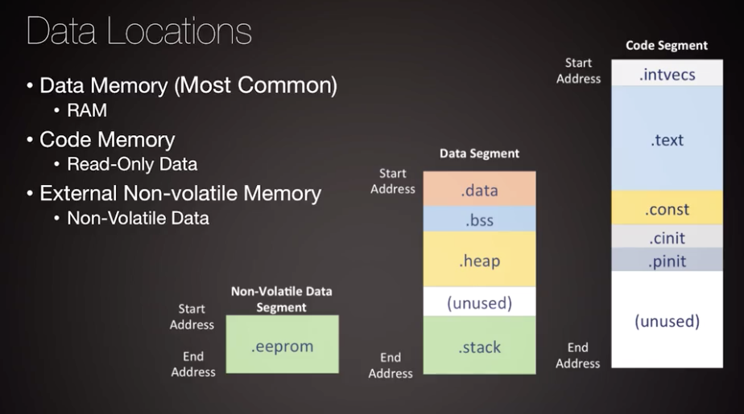
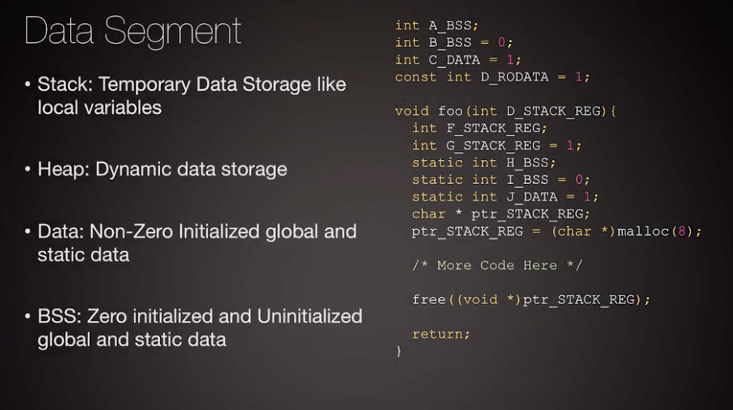
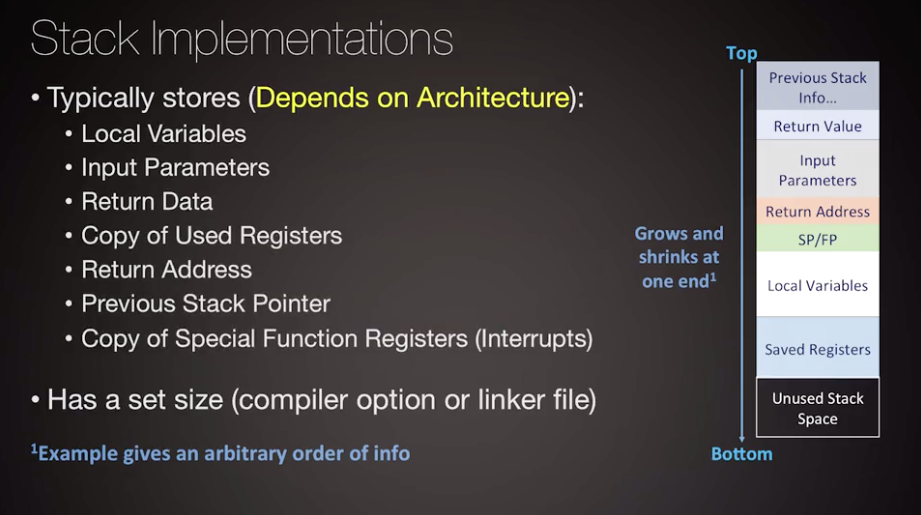
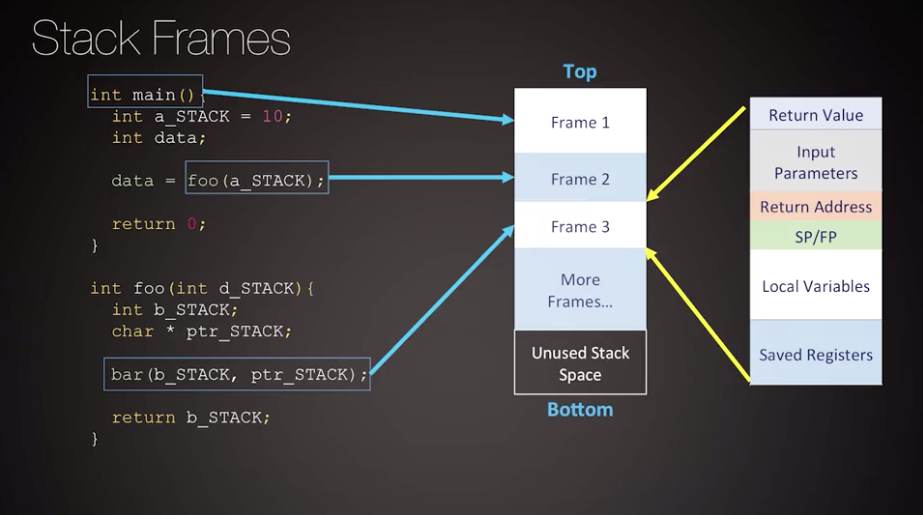

# Memory Types, Segments, and Management
* [Introduction to Memory Organization](#introduction-to-memory-organization)
* [Memory Architectures](#memory-architectures)
* [Memory Segments](#memory-segments)
* [Data Memory](#data-memory)
* [Special Keywords](#special-keywords)
* [The Stack](#the-stack)
* [The Heap](#the-heap)
* [Code Memory](#code-memory)

# Introduction to Memory Organization

* determine **memory footprint** before selecting a platform
* **FLASH**
	* program code
	* does *not* require power to retain information
	* ranges from 32 KB to 256 KB
* **RAM**
	* program data
	* requires power to retain information
	* ranges from 4 KB to 32 KB

* software to hardware translation
	* **linker file** describes memory regions to the build system
		* segment to sub-segment code to memory mapping
		* build a program with assigned memory addresses

* **dedicated controller** needed to configure, read, and write data in **FLASH** and **RAM** memory
	* built into the microcontroller
	* communicates with the **CPU** via a **BUS**

* *Example: add external memory to your system*
	* **EEPROM:** electrically erasable programmable read-only memory
	* **GPIO:** general purpose input/output
	* **SPI:** serial peripheral interface

* **register** memory
	* *not* associated with the installed program
	* exists across multiple microcontroller entities
	* stores configuration and runtime information ( the state of a program )
* **general purpose** registers store operands for CPU instructions
* **special purpose** registers store program state
	* current instruction
	* program counter

# Memory Architectures

## Capacity

## Volatility

## Access

## Latency

# Memory Segments

* Compiler
	* platform independent
	* CPU target architecture dependent
* Linker
	* platform dependent

* executable is mapped into physical memory (address space) via locating
* single address space, multiple segments / sub-segments

* ABI = application binary interface
	* compiler rules to perform translation from high-level language to architecture specific machine code
		* how to use the CPU and its registers

* **.data**
	* stack
	* heap
	* data
	* bss = block started by symbol [[wikipedia.org](https://en.wikipedia.org/wiki/.bss)]
		* in embedded software, the bss segment is mapped into memory that is initialized to zero by the C run-time system before main() is entered
		* **"Better Save Space"** since the BSS segment only holds variables that don't have any value yet, it doesn't actually need to store the image of these variables
* **.code**
	* intvecs = interupt vectors
	* text
	* read-only data
	* bootloader

# Data Memory
A data segment contains many different segments that are used for different kinds of data, allocation of data
can be at compile time or at run time.  Certain parts of the data segment can be reused and others exist
for the lifetime of a program.  Scope and access to variables can also dictate the section of the data segment
where certain pieces of data exist. 

* external non-volatile memory can be connected to the microcontroller to retain data between power cycles

# Special Keywords (Const, Extern, Static)

# The Stack

The stack is a vital memory segment for software developers. Stack is automatically used by the compiler, which in turn utilized architecture-specific processes and instructions to call and return from a routine. All of these operations get compiled into the function call. There's still overhead, in order to call and return from a function, and the memory region of the stack occupies part of data memory. This is reserved at compile time, allocated at run time, and the operations to interact with this region are introduced at compilation. However, the memory itself is reused throughout the program as different functions can get called to allocate and de-allocate data in this region.

A programmer can nest routines within one another. And the program has the ability to enter and return from each of these routines, without effecting the calling routine's state. The method of describing how to pass data in and out of a routine is referred to as a calling convention. This can be generalized across all routines in an architecture.  A calling convention should specify architecture specific concepts on how the CPU and the stack are used. Calling conventions differ across architectures, as ARM architecture have different calling conventions from other risk type processors. This is because internal CPU registers and a stack memory management needs to be modified to accommodate a change in normal execution flow, the stack is used to allocate, save, and restore information for a calling convention.

# The Heap

As embedded system architectures scale up in complexity and size, the likelihood of heap use on a system is a near guarantee. The heap requires direct invocations to utilize the memory, which leads to more overhead spent by the CPU to manage this region at runtime. This overhead existed with the stack as well, but the heap has the nice advantage of giving us a dynamic piece of memory that can have a lifetime longer than a function but less than a program.

# Code Memory

Code memory contains our program and also our data in some cases. The code memory is usually a lot larger than our data memory, because code memory is not meant to be rewritten during run time. When we install program code, we want that information to persist in between power cycles. More advanced architectures with embedded OS support allow for code memory to be written and installed while the processor is running. But most microcontrollers do not support it this way. Installing a new program requires a very particular process to interface with the flash memory. However, the way we broke down a program's code memory into the code segment is very similar to how we divided our data memory into smaller subsegments of data.

One last note about these code segments and these C standard functions. You do not automatically need to include these. Compilers will automatically use some C standard functions when your code is compiled. You can avoid the addition of all these extra sub segments by writing your own bare metal C with no standard library compiler flags. Or by writing your own assembly directly. However, this is not suggested as some of the standards library functionality makes writing your programs much easier. Like defining what happens at start up and program completion. In addition, it will map unsupported operations for your architecture into equivalent software processes.

